# ADO Repos

### Inline comments

**Prompt 1**
```
Leave a general comment on pull request with ID `2`: "Case 1. Local Elitea: This is a test comment".
```
Results:
- 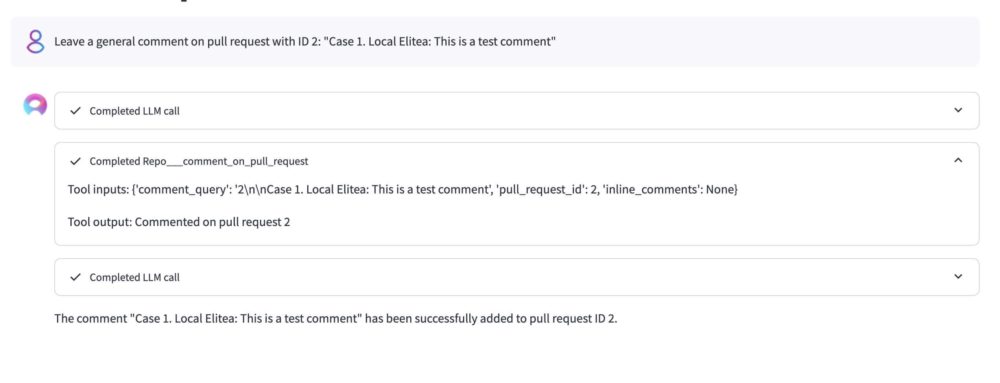
- 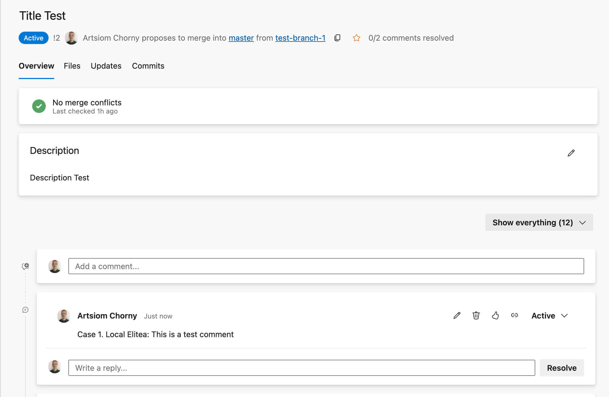

---
**Prompt 2**

```
Add a comment to pull request using the following query: `2\n\nCase 2. Local Elitea: Please review this PR`.
```
Results:
- 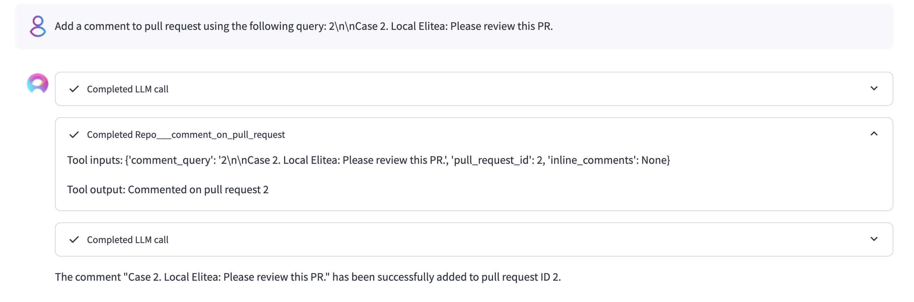
- 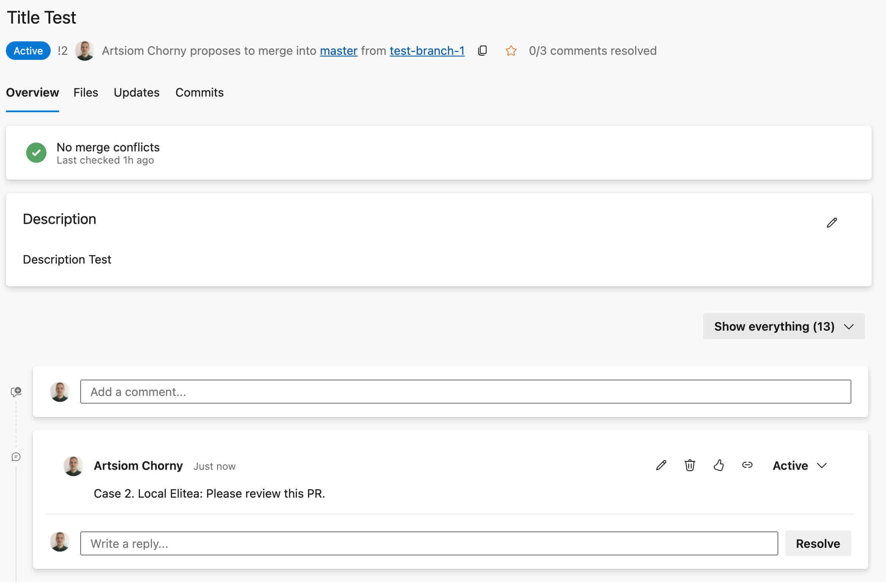

---
**Prompt 3**
```
Leave an inline comment on pull request with ID `2` in file `/azure-pipelines.yml`. The comment is: `"Case 3. Local Elitea: Logic needs improvement."` on left file line `35`.
```
Results:
- 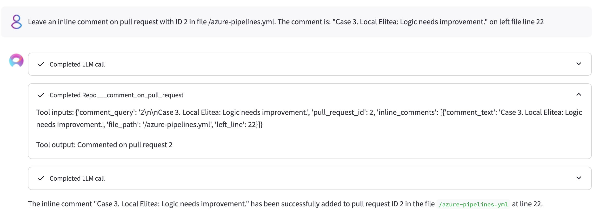
- 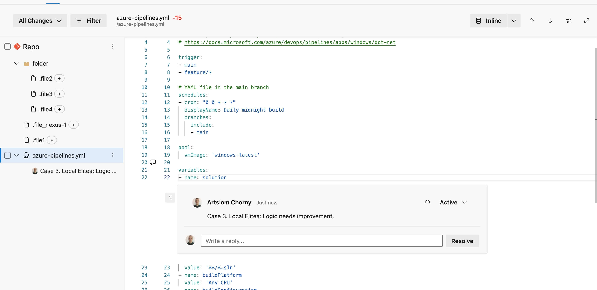

---
**Prompt 4**

```
Add an inline comment to PR ID `2` in file `/azure-pipelines.yml`. The comment content: `"Case 4. Local Elitea: Check this range of lines."` applies to the right range `(11, 16)`. Please ignore `right line` and `left line` attributes. Strictly use `right range` attribute instead
```
Results:
- 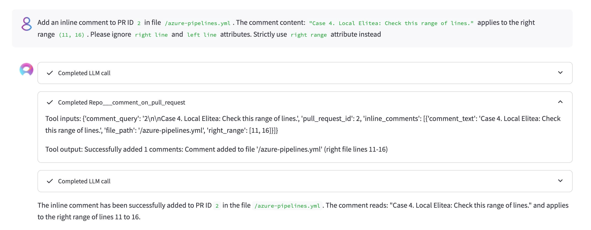
- 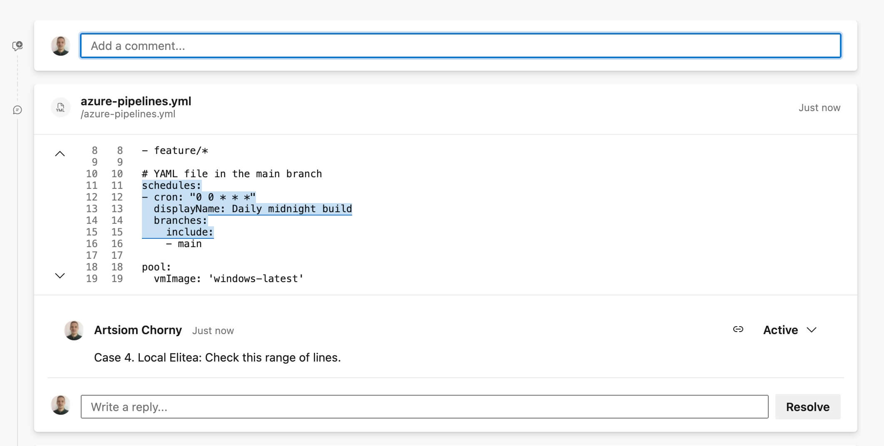

---
**Prompt 5**

```
Add the inline comments to PR ID `2` (strictly keep passing attribute names): """[{'file_path': '/azure-pipelines.yml', 'comment_text': 'Case 5-1. Local Elitea: Right Comment', 'right_line': 41}, {'file_path': '/azure-pipelines.yml', 'comment_text': 'Case 5-2. Local Elitea: Left Range Comment', 'left_range': (34, 49)}]"""
```
Results:
- 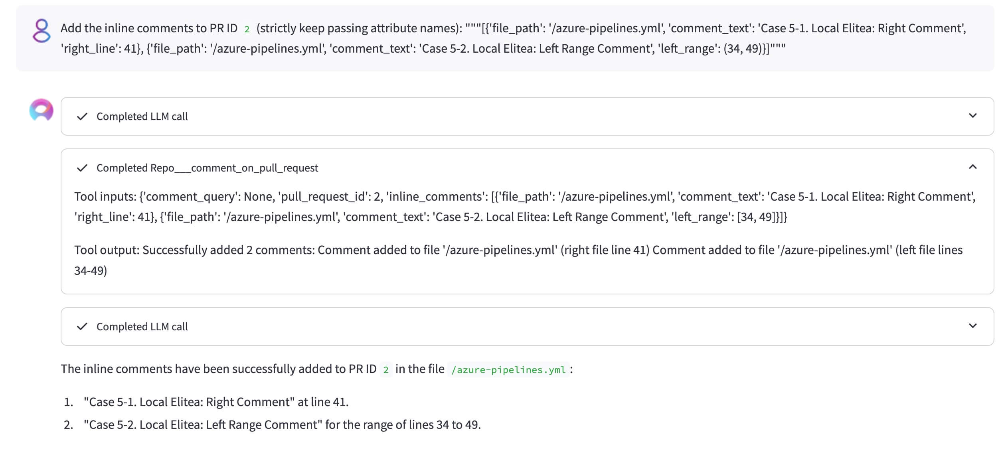
- 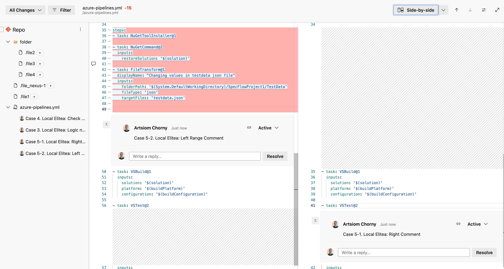
- 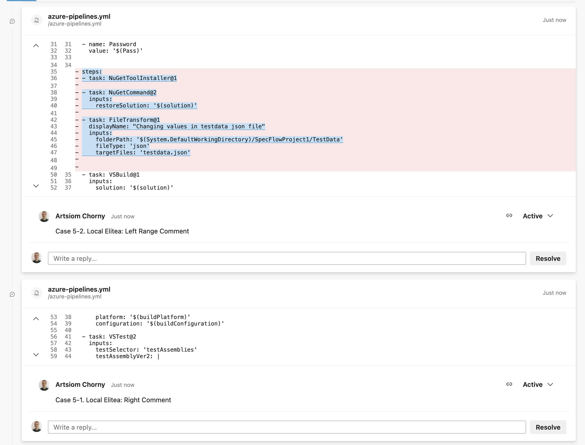

---
**Prompt 6**

```
Please add comment to PR 2
```

```
Please add inline comments to PR 2 within this list: [{'invalid_msg': '', 'no_line': 0}]
```
Results:
- 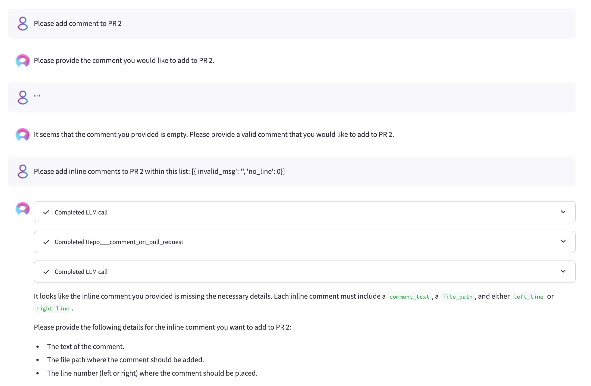

---

### Code search

`search_code` finds code by keyword when the file path is unknown, backed by the Azure
DevOps Code Search API. Searches are scoped to the toolkit's configured project and
repository automatically.

**Prompt 1**
```
Search the repository for `QueueJobsNow`.
```

**Prompt 2**
```
Find where `parse_response` is defined in Python files only.
```
Resolves to `parse_response ext:py`.

**Prompt 3**
```
Search for `retry` under src/services and return the next 5 matches after the first 5.
```
Resolves to `retry path:src/services` with `top=5`, `skip=5`.

#### Payload limits

The tool is deliberately bounded so results stay safe to feed back into an LLM:

| Control | Value |
|---|---|
| Files returned by default | 5 |
| `top` maximum | 1000 (Azure DevOps service limit) |
| `skip` maximum | 1000 — total reachable results cap at ~2000, refine the query instead of paging past it |
| Snippets per file | 3 |
| Snippet size | 2 lines of context either side, truncated at 400 characters |
| Files opened to build snippets | first 5 results per call, fetched concurrently |

Full file bodies are never returned — only the leading part of a matched file is read, up
to the last match offset. Each result carries `project`, `repository`, `path`, `file_name`,
`branch` and `match_count`; use `read_file` on a path to read a match in full. Set
`include_snippets=false` for a metadata-only response.

Raising `top` above 5 returns metadata for every result but snippets only for the first 5,
and the response carries a warning naming how many results were left without them. A
result whose match is on the file name rather than its content has `match_count: 0` and a
`matched_on` field instead of snippets.

The response reports `total_count` (all matched files), `returned`, `skip`, a `truncated`
flag and `next_skip` when more results remain.

#### Recommended usage

- Start broad, then narrow with `path:`, `file:` or `ext:` rather than raising `top`.
- Code type filters (`class:`, `def:`, `ref:`, `method:`, `comment:`, `strlit:`,
  `namespace:`) only work for **C#, C, C++, Java and VB.NET** files. Use plain text for
  Python, JavaScript, Go and everything else.
- Phrase and wildcard queries cannot be combined with code type filters, and a leading
  `*` wildcard is not supported. These come back as warnings in the response.

#### When a search returns nothing

- Azure DevOps indexes only the repository **default branch** unless more branches are
  added under **Project Settings → Repositories → Options → Searchable branches**. Leave
  `branch` unset unless the branch is known to be indexed.
- **Forked repositories are never indexed.**
- A freshly created or reindexing organization returns warnings such as "Branches are
  still being indexed" — results are incomplete until indexing finishes.

#### Access requirements

At least **Basic** access (Stakeholder access excludes code) and a token with the
**Code (read)** scope. On Azure DevOps Server the
[Code Search extension](https://marketplace.visualstudio.com/items?itemName=ms.vss-code-search)
must also be installed; on Azure DevOps Services code search is built in.
