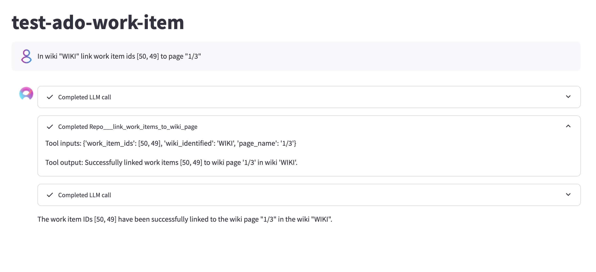
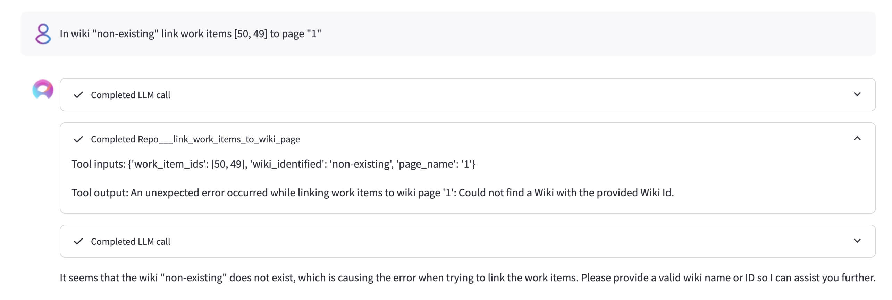
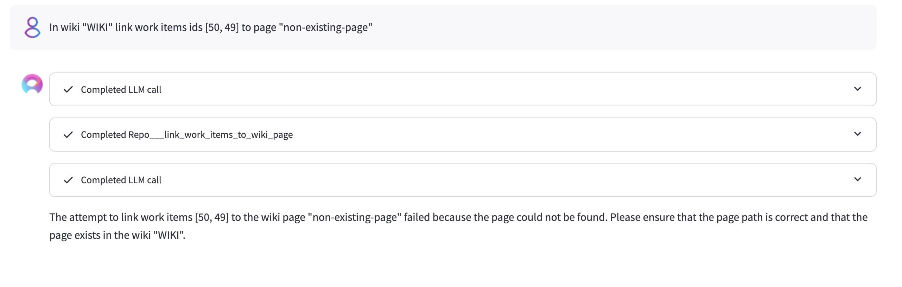
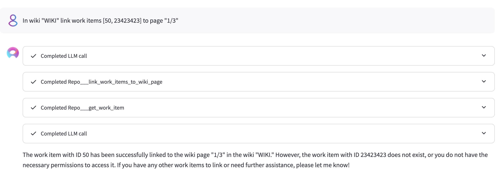
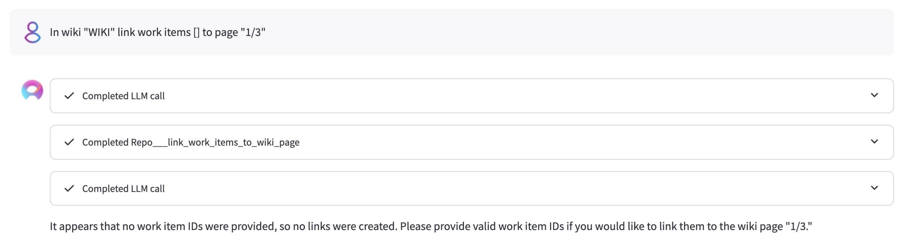
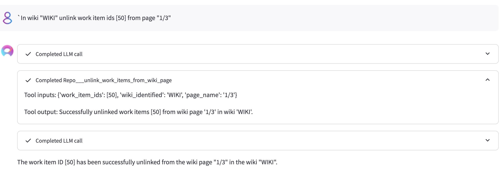

# ADO Work Item (Board)

### Link work items to wiki page

**Prompt 1**
```
In wiki "WIKI" link work item ids (50, 49] to page "1/3".
```
Results:
- 

---
**Prompt 2**

```
In wiki "non-existing" link work items [50, 49] to page "1".
```
Results:
- 

---
**Prompt 3**
```
In wiki "WIKI" link work items ids (50, 49] to page "non-existing-page".
```
Results:
- 

---
**Prompt 4**

```
In wiki "WIKI" link work items [50, 23423423] to page "1/3"
```
Results:
- 

---
**Prompt 5**

```
In wiki "WIKI" link work items [] to page "1/3"
```
Results:
- 


### Unlink work items from wiki page
---
**Prompt 6**

```
In wiki "WIKI" unlink work item ids [50] from page "1/3"
```

Results:
- 

---

### Work item text search

`search_work_items_by_text` finds work items by keyword or phrase, backed by the Azure DevOps Work Item Search API. Searches are scoped automatically to the toolkit's configured project.

Use it when you do not have a WIQL query. For structured queries over fields, dates or links, use `search_work_items`, which takes WIQL.

**Prompt 1**

```
Find work items mentioning login timeout.
```

**Prompt 2**

```
Search for bugs about the payment gateway that are still active.
```
Resolves to query `payment gateway` with `work_item_type=["Bug"]`, `state=["Active"]`.

**Prompt 3**

```
Show the next 5 matches for crash after the first 5.
```
Resolves to `top=5`, `skip=5`.

#### Payload limits

| Control | Value |
|---|---|
| Work items returned by default | 5 - independent of the toolkit's **Limit** setting, which applies to `search_work_items` |
| `top` maximum | 50 - page with `skip` rather than raising it |
| `skip` maximum | 1000 |
| Matched-field highlights | off by default - set `include_highlights=true`; then the first 5 results that matched a field carry them, whatever `top` is |
| Highlights per work item | up to 3 matched fields, the first excerpt from each |
| Highlight size | HTML flattened to plain text, then truncated at 200 characters |
| Worst-case response | about 26 KB at `top=50`, about 30 KB with highlights on - titles and assignee names are not truncated, so this is indicative rather than a hard cap |

#### Returned fields

Each result carries `id`, `title`, `type`, `state`, `project` and `url`, plus `assigned_to` when the work item has an assignee. Full work item bodies, descriptions, comments, relations and attachments are never returned - use `get_work_item` on an id to read one in full.

Set `include_highlights=true` to add a `highlights` list naming the field that matched and a short excerpt. Free text also matches description, acceptance criteria, tags, history and comments, so a result whose title does not contain the query term is common - without highlights there is no indication of why it was returned. Leave it off when you only need a list of ids and titles.

The response reports `total_count` (all matched work items), `returned`, `skip`, a `truncated` flag, and `next_skip` when there is a further window worth requesting. A `warnings` list appears only when the service returned an info code, when nothing matched, when the paging limit was reached, or when results beyond the highlight budget were returned as metadata alone.

#### Paging

Pass the `next_skip` value from a response as the `skip` of the next call. Stop on either of two signals: `next_skip` is absent - the key is never returned empty or null - or a second window in a row comes back empty, which means the token cannot read these matches and no amount of paging will surface them.

`truncated` describes the *result set*, not the page you just received: it is `true` whenever the service counted more matches than the window you requested. A page can come back empty while matches remain, because Azure DevOps counts every match and then removes the ones your token cannot read, reporting info code 11 in `warnings`. In that case the response still supplies a `next_skip`: work item permissions are granted per area path, so an unreadable stretch of the ranking says nothing about what follows it, and the readable matches further down are worth fetching. `search_code` ends paging on the same info code, because code read permission is per repository and a single-repository search that returns nothing readable will never return anything. An empty window advances the cursor by 50 rather than by your `top`: the rows it steps over are the ones the service just declined to return, and striding clears an unreadable stretch in tens of calls instead of hundreds. Rows inside that stride are not examined, so a sparsely-readable result set can yield fewer matches than a full walk would - the alternative is up to 200 round trips for the same query.

Paging always terminates. `next_skip` is `skip` plus the `top` you asked for, or plus 50 when the window came back empty, so it strictly increases with every call. It is withheld once the next window would pass the `skip` ceiling of 1000 - `warnings` then explains that the paging limit was reached - and `truncated` turns `false` once the window passes the end of the result set. When no `next_skip` comes back, or when a second window in a row comes back empty, stop and refine the query instead.

#### Recommended usage

- Start broad, then narrow with `work_item_type`, `state`, `assigned_to` or `area_path` rather than raising `top`. With highlights on, only the first five matched results carry them, so a larger `top` buys metadata, not evidence.
- Turn `include_highlights` on when ranking or explaining results; it costs about 4 KB at `top=50` and is the only signal of which field matched.
- Filter values must match Azure DevOps exactly - `User Story`, not `story`; assignees are stored as `Display Name <email>`.
- Search indexes title, description, acceptance criteria, tags, history and comments. It does not read attachment contents.
- Newly created or edited work items can take a few minutes to appear in the index.
- Work Item Search is built into Azure DevOps Services. On Azure DevOps Server it requires the Search extension to be installed, and the token needs the Work Items (read) scope.
